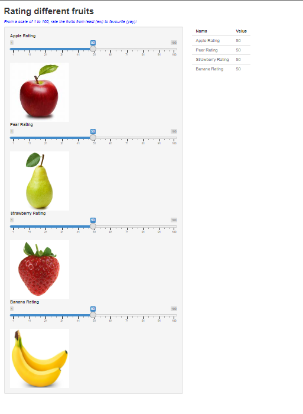

```{r setup, include=TRUE}
knitr::opts_chunk$set(echo = TRUE)
```

## Screenshot of application 
```{r, echo=TRUE, eval=TRUE}

```

## Explanation 

1. The example used here is "runExample("05_sliders")"

2. The edits made are to change the values of the sliders and the type, not including data values like currency, etc. 

3. Include fruit photos for each fruit 

4. Include subheader to explain how the rating values work (as a legend)


##For reference: 

## The Codes: 

# Making customizations
library(shiny)
#runExample("05_sliders")

# Define UI for slider demo app ----
ui <- fluidPage(
  
  # App title ----
  titlePanel(strong("Rating different fruits")),
  
  # Subtitle ----
  h5(em("From a scale of 1 to 100, rate the fruits from least (ew) to favourite (yay)!", style="color:blue")),
  
  # Sidebar layout with input and output definitions ----
  sidebarLayout(
    
    # Sidebar to demonstrate various slider options ----
    sidebarPanel(
      
      # Input: Simple apple interval ----
      sliderInput("apple", "Apple Rating",
                  min = 1, max = 100,
                  value = 50, step=1),
      img(src ="apple.jpg", height =200, width =200),
      
      # Input: Simple pear interval ----
      sliderInput("pear", "Pear Rating",
                  min = 1, max = 100,
                  value = 50, step=1),
      img(src ="pear.jpg", height =200, width =200),
      
      # Input: Simple strawberries interval ----
      sliderInput("strawberry", "Strawberry Rating",
                  min = 1, max = 100,
                  value = 50, step=1),
      img(src ="strawberry.jpg", height =200, width =200),
      
      # Input: Simple banana interval ----
      sliderInput("banana", "Banana Rating",
                  min = 1, max = 100,
                  value = 50, step=1),
      img(src ="banana.jpg", height =200, width =200)
    ),
    
    # Main panel for displaying outputs ----
    mainPanel(
      
      # Output: Table ----
      tableOutput("fruits"))
  ))

# Define server logic for slider examples ----
server <- function(input, output) {
  
  # Reactive expression to create data frame of all input values ----
  sliderValues <- reactive({
    
    data.frame(
      Name = c("Apple Rating",
               "Pear Rating",
               "Strawberry Rating",
               "Banana Rating"),
      Value = as.character(c(input$apple,
                             input$pear,
                             input$strawberry,
                             input$banana)),
      stringsAsFactors = FALSE)
})
  
  # Show the values in an HTML table ----
  output$fruits <- renderTable({
    sliderValues()
  })

}

# Create Shiny app ----
shinyApp(ui, server)


Thank you :)
