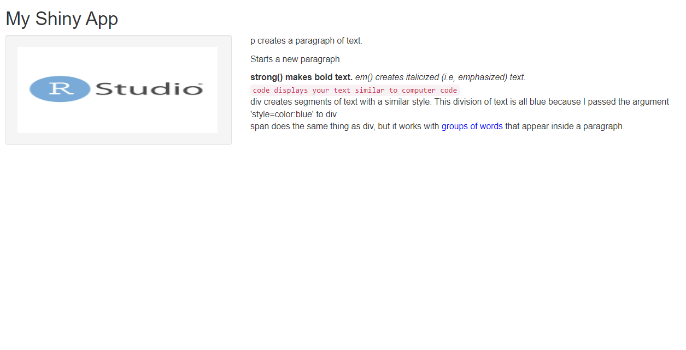

```{r setup, include=FALSE}
knitr::opts_chunk$set(echo = TRUE)
```

## Screenshot of application 
```{r, echo=TRUE, eval=TRUE}

```

# Visualizing data using "shiny" 
```{r, echo=FALSE, eval=FALSE}
# Install package 
install.packages("shiny")

#Invoking the packages 
library(shiny)

#Running an example from the library 
##runExample("01_hello")
```

# Creating an App and making edits 
```{r,eval=TRUE,echo=TRUE}
#User interface 
library(shiny)
# Define UI for app that draws a histogram ----
ui <- fluidPage(
  # App title ----
  titlePanel("Hello World!"),
  # Sidebar layout with input and output definitions ----
  sidebarLayout(
    # Sidebar panel for inputs ----
    sidebarPanel(
      # Input: Slider for the number of bins ----
      sliderInput(inputId ="bins",label = "Number of bins:",min =5,max =50,value =30)),
    # Main panel for displaying outputs ----
    mainPanel(
      # Output: Histogram ----
      plotOutput(outputId = "distPlot"))))

# Define server logic required to draw a histogram ----
server <- function(input, output) {
  output$distPlot <- renderPlot({
    x <- faithful$waiting 
    bins <- seq(min(x), max(x), length.out = input$bins +1)
    hist(x, breaks = bins, col ="#007bc2", border ="yellow",
         xlab = "Waiting time to next eruption (in mins)",
         main ="Histogram of waiting times")
  })
}
```

